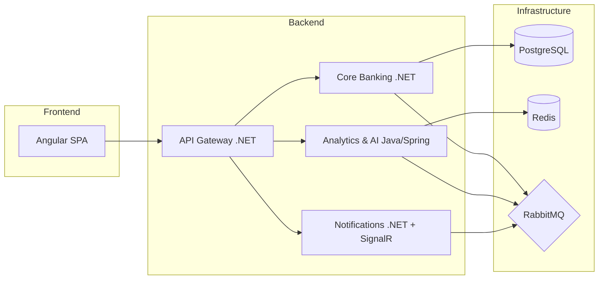
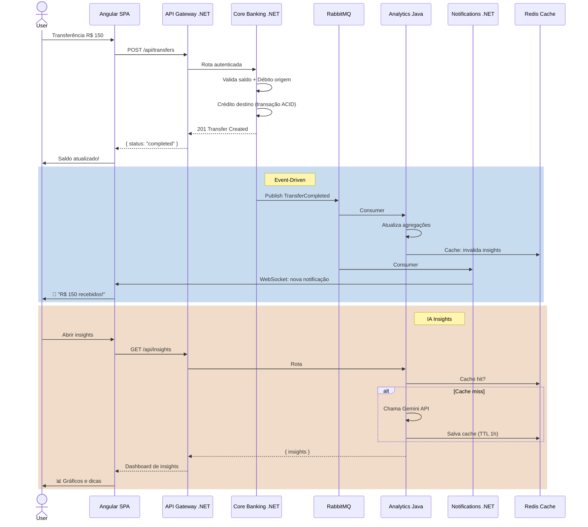

# CashFlow Pro — BootCamp Context

## Sobre o Projeto

Plataforma fintech educacional para aprender na prática:

- **.NET** (ASP.NET Core 8+) — Core Banking, API Gateway, Notifications
- **Java** (Spring Boot 3) — Analytics & AI Insights
- **Angular 18** — Frontend SPA
- **System Design** — Event-Driven Architecture, DDD, Microserviços
- **IA** — Gemini API para insights financeiros
- **Observabilidade** — OpenTelemetry, Prometheus, Grafana
- **WebSocket** — SignalR para notificações em tempo real

> 💡 **CashFlow Pro** é seu laboratório técnico de férias. O **Finance Guy** (Next.js + TypeScript) é seu app financeiro real. Este é o playground para aprender stacks enterprise.

---

## 🏗️ Arquitetura



### Serviços

| Serviço | Stack | Responsabilidade |
|---------|-------|-----------------|
| **Core Banking** | .NET 8+, EF Core, PostgreSQL | Contas, transferências, ledger, eventos de domínio (DDD) |
| **Analytics & AI** | Java Spring Boot 3, Redis, Gemini API | Insights financeiros, detecção de fraude, health score, cache |
| **Notifications** | .NET 8+, SignalR, Redis backplane | WebSocket em tempo real, notificações, presença |
| **API Gateway** | .NET 8+ (YARP/Ocelot) | Roteamento, JWT, rate limiting |
| **Frontend** | Angular 18 (Standalone, Signals) | Dashboard, transferências, insights |

### Infraestrutura

| Componente | Versão | Função |
|------------|--------|--------|
| PostgreSQL | 16 | Banco principal (Core Banking, Analytics) |
| Redis | 7 | Cache distribuído, sessões WebSocket, rate limiting |
| RabbitMQ | 4 | Event Bus / Mensageria |
| Docker Compose | - | Orquestração local |

---

## 📅 BootCamp — 3 Sprints (3 Semanas)

### Sprint 1: Fundação .NET + System Design ✅ CONCLUÍDA

**Foco:** Core Banking, DDD, Event-Driven, ASP.NET Core, EF Core, RabbitMQ, Docker Compose

| Tarefa | Status |
|--------|--------|
| Setup do monorepo + docker-compose | ✅ |
| Core Banking: Account & Transaction aggregates (DDD) | ✅ |
| Eventos de domínio: TransactionCreated, TransferCompleted | ✅ |
| RabbitMQ integration (publisher) | ✅ |
| Testes de unidade e integração (xUnit) | ✅ |
| API REST: criar conta, transferência, extrato | ✅ |
| Swagger/OpenAPI documentation | ✅ |

### Sprint 2: Java + Angular + WebSocket

**Foco:** Spring Boot 3, Angular 18, SignalR, Redis Cache, integração polyglot

| Tarefa | Status |
|--------|--------|
| Analytics Service (Java/Spring): consome eventos do RabbitMQ | ⬜ |
| Redis: cache de agregações financeiras (Cache-Aside) | ⬜ |
| Notification Service (.NET + SignalR): WebSocket em tempo real | ⬜ |
| Angular SPA: Dashboard com gráficos, transferências | ⬜ |
| Integração Angular → Gateway → Serviços | ⬜ |
| Testes E2E com Playwright | ⬜ |

**Branch Strategy:**

| Branch | Dependência | Descrição |
|--------|-------------|-----------|
| `feature/java-analytics` | - | Java/Spring Analytics Service + RabbitMQ consumer |
| `feature/redis-cache` | java-analytics | Cache Redis com Cache-Aside pattern |
| `feature/notifications-signalr` | - | Notification Service .NET + SignalR |
| `feature/angular-frontend` | - | Angular 18 SPA Dashboard |
| `feature/angular-integration` | angular-frontend, notifications-signalr | API Gateway + integração |
| `feature/e2e-playwright` | Todas anteriores | Testes E2E com Playwright |

### Sprint 3: IA + Observabilidade + Resilience

**Foco:** Gemini API, OpenTelemetry, Prometheus/Grafana, Rate Limiting, Circuit Breaker

| Tarefa | Status |
|--------|--------|
| AI Insights Service: consumo de eventos + classificação inteligente | ⬜ |
| Gemini API: prompts para insights financeiros | ⬜ |
| Cache de prompts e respostas LLM no Redis | ⬜ |
| OpenTelemetry: tracing distribuído em todos os serviços | ⬜ |
| Prometheus + Grafana: dashboards de métricas | ⬜ |
| Redis Rate Limiting (sliding window) | ⬜ |
| Health Checks + Circuit Breaker | ⬜ |
| Documentação final e ADRs | ⬜ |

---

## 🔀 Fluxo de Dados

### Transferência Financeira (Exemplo: R$ 150)



**Padrões de integração:**

1. **Síncrono** (API REST) → Transferência confirmada na hora com consistência ACID
2. **Assíncrono** (Eventos/RabbitMQ) → Analytics e Notifications processam em background
3. **Real-time** (WebSocket/SignalR) → Notificações chegam no Angular sem refresh
4. **Cache** (Redis) → Insights cacheados com TTL, eviction por evento

---

## 🛠️ Tech Stack

| Tecnologia | Uso | Sprint |
|------------|-----|--------|
| ASP.NET Core 8+ | Core Banking, Gateway, Notifications | S1, S2 |
| SignalR | WebSocket real-time | S2 |
| Java Spring Boot 3 | Analytics & AI Service | S2, S3 |
| Angular 18 | Frontend SPA | S2 |
| PostgreSQL 16 | Banco principal | S1 |
| Redis 7 | Cache, Sessões, Rate Limiting | S2, S3 |
| RabbitMQ 4 | Event Bus | S1 |
| Docker Compose | Orquestração local | S1 |
| OpenTelemetry | Tracing distribuído | S3 |
| Prometheus + Grafana | Métricas e Dashboards | S3 |
| Gemini API | AI Insights | S3 |
| xUnit + TestContainers | Testes .NET | S1 |
| JUnit + TestContainers | Testes Java | S2 |
| Playwright | Testes E2E | S2 |

---

## 📂 Estrutura do Repositório

```
CashFlowPro/
├── docker-compose.yml          # Orquestração local
├── .env                        # Variáveis de ambiente
├── .gitignore
├── AGENTS.md                   # Este arquivo
├── docs/                       # Documentação
│   └── specs/                  # Specs de features
│   └── ADR/                    # Architecture Decision Records
├── infra/                      # Scripts de infra
│   └── postgres/
│       └── init.sql
├── src/
│   ├── ApiGateway/             # .NET API Gateway (YARP/Ocelot)
│   ├── CoreBanking/            # .NET Core Banking Service
│   │   ├── Controllers/        # REST endpoints
│   │   ├── Data/               # EF Core DbContext, Migrations
│   │   ├── Domain/             # DDD: Aggregates, Value Objects
│   │   │   ├── Accounts/       # Account aggregate
│   │   │   └── Transaction/    # Transaction value objects
│   │   ├── Events/             # Domain events + RabbitMQ publishing
│   │   ├── Models/             # DTOs, ViewModels
│   │   ├── Services/           # Application services
│   │   └── Dockerfile
│   ├── Analytics/              # Java Spring Boot (Sprint 2)
│   ├── Notifications/          # .NET + SignalR (Sprint 2)
│   └── Frontend/               # Angular 18 (Sprint 2)
├── tests/
│   └── CoreBanking.Tests/      # Testes unitários xUnit
│       ├── Domain/
│       │   ├── Accounts/
│       │   │   ├── AccountTests.cs
│       │   │   └── MoneyTests.cs
│       │   └── Transactions/
│       │       └── TransactionTests.cs
│       └── CoreBanking.Tests.csproj
└── prototypes/                 # Protótipos isolados
```

---

## 🧪 Estratégia de Testes

| Camada | Framework | O que testar |
|--------|-----------|-------------|
| .NET Unit | xUnit + Moq | Domain aggregates, services, eventos |
| .NET Integration | TestContainers | EF Core + PostgreSQL, RabbitMQ |
| Java Unit | JUnit + Mockito | Analytics services, AI adapter |
| Java Integration | TestContainers | Spring Data JPA + PostgreSQL, Redis |
| Angular | Jasmine + Karma | Componentes, serviços, signals |
| E2E | Playwright | Fluxos completos (transferência, dashboard) |

---

## 🧪 Ambiente de Testes — xUnit

| Componente | Configuração |
|---|---|
| **Framework** | xUnit 2.9+ |
| **Runner** | `Microsoft.NET.Test.Sdk` |
| **Mock** | Moq |
| **Coverage** | Coverlet |
| **Projeto** | `tests/CoreBanking.Tests/` |

### Estrutura de Testes

```
tests/
└── CoreBanking.Tests/
    ├── Domain/
    │   ├── Accounts/
    │   │   ├── AccountTests.cs        — Regras de negócio
    │   │   └── MoneyTests.cs          — Value Object
    │   └── Transactions/
    │       └── TransactionTests.cs    — Criação e lógica
    └── CoreBanking.Tests.csproj       — Projeto xUnit
```

### Casos de Teste — Account

| # | Teste | Regra |
|---|---|---|
| 1 | `Debit_ShouldDecreaseBalance` | Débito reduz saldo corretamente |
| 2 | `Debit_ShouldThrowWhenExceedingOverdraft` | Saldo - valor < -500 → exceção |
| 3 | `Credit_ShouldIncreaseBalance` | Crédito aumenta saldo corretamente |
| 4 | `Credit_ShouldThrowWhenNegative` | Valor <= 0 → exceção |
| 5 | `Close_ShouldThrowWhenBalanceNotZero` | Saldo pendente impede fechamento |
| 6 | `Open_ShouldCreateActiveAccount` | Nova conta começa ativa com saldo 0 |

### Casos de Teste — Transaction

| # | Teste | Regra |
|---|---|---|
| 1 | `Create_ShouldGenerateId` | Transaction.Create gera Id válido |
| 2 | `Create_ShouldAssignDefaultDescription` | Se description null, usa lógica do switch |
| 3 | `Create_ShouldAssignCustomDescription` | Se description fornecida, usa o valor |

### Comandos de Teste

```bash
# Rodar todos os testes
dotnet test

# Rodar com verbose
dotnet test --logger "console;verbosity=detailed"

# Rodar com coverage
dotnet test /p:CollectCoverage=true /p:CoverletOutput=../coverage/

# Rodar testes de um projeto específico
dotnet test tests/CoreBanking.Tests/
```

---

## 🚀 Como Rodar

```bash
# Subir infraestrutura (PostgreSQL, Redis, RabbitMQ)
docker compose up -d

# Core Banking (.NET)
cd src/CoreBanking && dotnet run

# Analytics (Java) — Sprint 2
cd src/Analytics && ./mvnw spring-boot:run

# Frontend (Angular) — Sprint 2
cd src/Frontend && npm start
```

---

## 📐 Decisões de Arquitetura (ADRs)

- **ADR-001**: Polyglot microservices (.NET + Java) com RabbitMQ como barramento de eventos
- **ADR-002**: Event-Driven Architecture para comunicação assíncrona entre serviços
- **ADR-003**: Redis como cache distribuído + backplane WebSocket + rate limiting
- **ADR-004**: API Gateway como único entry point (roteamento, auth, rate limiting)
- **ADR-005**: OpenTelemetry para observabilidade unificada (tracing, métricas, logs)

---

## 🌿 Workflow de Desenvolvimento

1. Cada sprint tem seu próprio checkpoint/branch
2. Commits descritivos seguindo [Conventional Commits](https://www.conventionalcommits.org/)
3. Testes antes de implementar (TDD quando possível)
4. Documentar decisões em ADRs
5. Ao final de cada sprint, revisar e atualizar o AGENTS.md

---

## ⚠️ Erros Comuns e Correções (Referência Rápida)

### Erros de Compilação .NET

| Erro | Causa | Correção |
|------|-------|----------|
| `MSB1003: Especifique um arquivo de solução ou de projeto` | `.csproj` ou `.sln` deletado/movido | Recriar com `dotnet new` ou restaurar do git |
| `The type or namespace name 'X' could not be found` | Faltou `using` no topo do arquivo | Adicionar `using CoreBanking.Domain.X;` |
| `CS0117: 'Type' does not contain a definition for 'Y'` | Nome de propriedade errado (ex: `AccountID` vs `AccountId`) | Verificar se a propriedade existe na classe |
| `CS1001: Identifier expected` | Erro de sintaxe (ex: `Gui` em vez de `Guid`) | Corrigir o tipo |

### Erros de Referência entre Arquivos

| Arquivo | Erro Comum | Correção |
|---------|-----------|----------|
| `TransferService.cs` | Usar `_db.Transaction` (singular) | O DbSet é `_db.Transactions` (plural) |
| `TransferService.cs` | Faltam `using` para `Domain.Transaction` | Adicionar `using CoreBanking.Domain.Transaction;` |
| `TransactionConfiguration.cs` | `.hasMaxLength` (minúsculo) | C# é case-sensitive: `.HasMaxLength` |
| `TransactionConfiguration.cs` | Faltam `using` para `Account` | Adicionar `using CoreBanking.Domain.Accounts;` |
| `TransferCompleted.cs` | Faltou `namespace` | Adicionar `namespace CoreBanking.Domain.Transaction.Events;` |

### Erros de Lógica (Compilam mas funcionam errado)

| Erro | Problema | Correção |
|------|----------|----------|
| `Transaction.cs` com `TransferOut =>` duplicado | Segundo caso deveria ser `TransferIn` | Trocar para `TransactionType.TransferIn => "Transferência Recebida"` |
| `Account.cs` com `Guid ID` e `Id = Guid.NewGuid()` | Nome da propriedade (`ID`) diferente do uso (`Id`) | Padronizar: usar `Id` em ambos |
| `Transaction.cs` com `Gui AccountID` | Tipo `Gui` não existe | Usar `Guid AccountId` |

### Convenções .NET para Evitar Erros

| Regra | Exemplo Correto | Exemplo Errado |
|-------|----------------|----------------|
| DbSet sempre no **plural** | `DbSet<Transaction> Transactions` | `DbSet<Transaction> Transaction` |
| Propriedade `Id` (não `ID`) | `public Guid Id` | `public Guid ID` |
| Métodos começam com **maiúscula** | `.HasMaxLength()`, `.IsRequired()` | `.hasMaxLength()`, `.isRequired()` |
| Namespace = caminho da pasta | `Domain.Transaction` | `Domain.Transaction` (consistente) |
| `Guid` (não `Gui` ou `GUID`) | `public Guid Id` | `public Gui Id` |

### Fluxo de Verificação Antes de Pedir Ajuda

```
1. dotnet build src/CoreBanking
   ↓ erro?
2. Ler a PRIMEIRA linha do erro (a causa real)
   ↓ não entendeu?
3. Verificar:
   - O arquivo .csproj existe?
   - Os namespaces batem com os usings?
   - Os nomes das propriedades estão corretos?
   - C# é case-sensitive?
   ↓ ainda com erro?
4. Perguntar aqui com a MENSAGEM DO ERRO
```

---

---

## 📚 Base de Conhecimento Indexada (KB)

O `AGENTS.md` é a visão geral do projeto. O detalhamento por especialização está indexado em `docs/` e serve de referência para o agente **Tutor** (`tutor.md`).

| Especialização | Documento |
|----------------|-----------|
| System Design / Arquitetura | [`docs/architecture/system-design.md`](docs/architecture/system-design.md) |
| Event-Driven / RabbitMQ | [`docs/architecture/event-driven.md`](docs/architecture/event-driven.md) |
| Back-End .NET (Core Banking, DDD, convenções, erros) | [`docs/backend/dotnet-core-banking.md`](docs/backend/dotnet-core-banking.md) |
| Back-End Java (Analytics, Redis, Gemini) | [`docs/backend/java-analytics-ai.md`](docs/backend/java-analytics-ai.md) |
| Front-End Angular 18 | [`docs/frontend/angular-spa.md`](docs/frontend/angular-spa.md) |
| Testes (xUnit, JUnit, Jasmine, Playwright) | [`docs/testing/testing-guide.md`](docs/testing/testing-guide.md) |
| Workflow (commits, dependências, ADRs) | [`docs/workflow/development-standards.md`](docs/workflow/development-standards.md) |
| Verificação de tarefas (EVAl) | [`docs/eval.sh`](docs/eval.sh) |

> **Regra de ouro:** consulte sempre o doc da especialização antes de aprofundar um tema. O Tutor usa essa base para responder e direcionar o estudo.

## 👤 Contexto do Desenvolvedor

- **Nome:** Rafael Augusto Nascimento Novais
- **Projeto paralelo:** [Finance Guy](https://github.com/oN0V41S/controleFinanceiro) (Next.js + TypeScript)
- **Faculdade:** ADS — UNiSA
- **Estudos em andamento:** Java Spring + Angular (BootCamp Avanade/DIO), Microsoft AI & ML Engineering Certificate
- **Stack atual:** TypeScript, Node.js, Next.js, React, PostgreSQL, Prisma, Docker
- **Stack alvo:** .NET, Java, Angular, System Design, IA, Observabilidade
