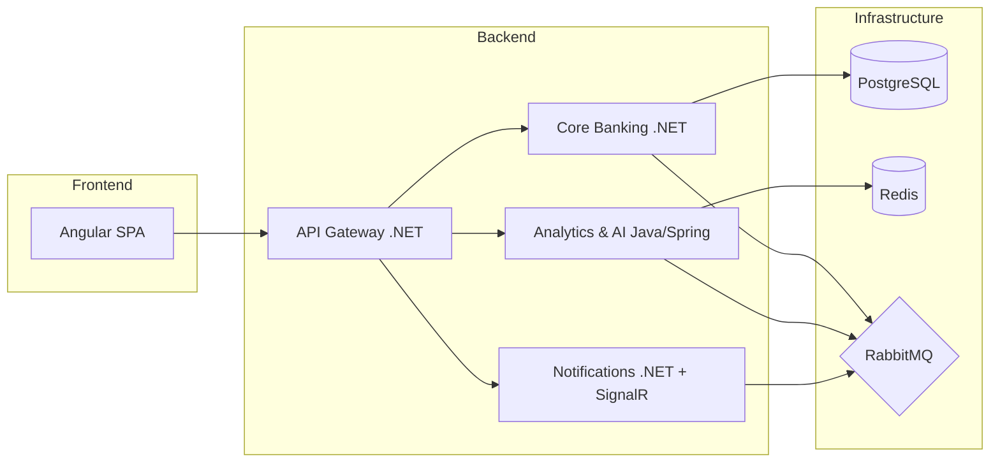

# 🚀 CashFlow Pro

> **Laboratório Técnico & Plataforma Fintech Educacional**

O **CashFlow Pro** é um projeto desenvolvido exclusivamente para **fins educacionais**, com o objetivo de praticar, explorar e dominar conceitos avançados de engenharia de software, arquitetura de microsserviços, ecossistemas polyglot e stacks enterprise modernas.

---

## 🎯 Propósito Educacional

Este repositório funciona como um ambiente de estudos prático (um *playground* técnico) para consolidar conhecimentos em:
- **Arquitetura de Microsserviços & Domain-Driven Design (DDD)**
- **Comunicação Assíncrona & Event-Driven Architecture (RabbitMQ)**
- **Ecossistema .NET (ASP.NET Core 8+, EF Core, xUnit)**
- **Ecossistema Java (Spring Boot 3, Spring Data, Gemini AI Integration)**
- **Frontend Moderno (Angular 18 com Standalone Components & Signals)**
- **Observabilidade, Resiliência e IA Aplicada**

---

## 🏗️ Arquitetura do Sistema



### Serviços e Tecnologias

| Serviço | Stack Principal | Responsabilidade Educacional |
|---------|-----------------|-----------------------------|
| **Core Banking** | .NET 8+, EF Core, PostgreSQL | Contas, transferências, ledger e aplicação de regras de domínio (DDD). |
| **Analytics & AI** | Java Spring Boot 3, Redis, Gemini API | Insights financeiros inteligentes, detecção de fraudes e health score. |
| **Notifications** | .NET 8+, SignalR, Redis Backplane | WebSocket em tempo real e notificações instantâneas. |
| **API Gateway** | .NET 8+ (YARP / Ocelot) | Roteamento de requisições, autenticação JWT e rate limiting. |
| **Frontend** | Angular 18 (Standalone, Signals) | Dashboard interativo, visualização de gráficos e transferências. |

---

## 📅 Roteiro de Estudos (BootCamp de 3 Sprints)

- **Sprint 1 (Fundação .NET + System Design):** Core Banking, Agregados DDD, Eventos de Domínio, EF Core e integração com RabbitMQ.
- **Sprint 2 (Java + Angular + WebSocket):** Microsserviço de Analytics em Spring Boot, Cache com Redis, Notificações em tempo real com SignalR e SPA em Angular 18.
- **Sprint 3 (IA + Observabilidade + Resiliência):** Integração com a Gemini API, Tracing distribuído com OpenTelemetry, Prometheus/Grafana e Circuit Breaker.

---

## 🚀 Como Rodar o Ambiente Localmente

### Pré-requisitos
- Docker & Docker Compose
- .NET SDK 8+
- Java 17+ / Maven
- Node.js 18+ (para o Angular)

### 1. Subir Infraestrutura (PostgreSQL, Redis, RabbitMQ)
```bash
docker compose up -d
```

### 2. Rodar o Core Banking (.NET)
```bash
cd src/CoreBanking
dotnet run
```

---

## 🌿 Autor & Contexto
Desenvolvido por **Rafael Augusto Nascimento Novais** como parte dos estudos práticos em desenvolvimento de software backend e system design.
```