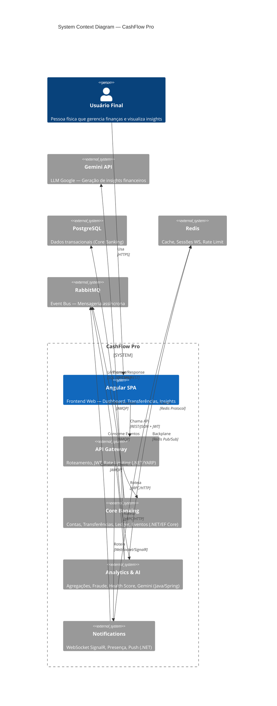

# Nível 1 — System Context Diagram

Visão de alto nível do **CashFlow Pro** como uma "caixa preta" e seus atores externos.

## Legenda

| Símbolo | Significado |
| :--- | :--- |
| `Person` | Ator humano externo ao sistema |
| `System` | Sistema interno (parte do CashFlow Pro) |
| `System_Ext` | Sistema externo (fora do escopo do CashFlow Pro) |
| `Rel` | Relacionamento / fluxo de dados |