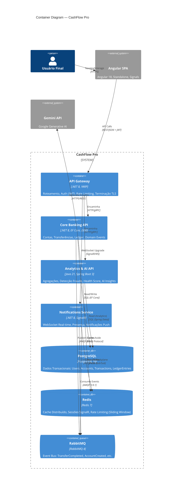

# Nível 2 — Container Diagram

Zoom no **CashFlow Pro** mostrando suas aplicações (containers executáveis) e armazenamentos de dados.

## Containers — Resumo

| Container | Tipo | Tecnologia | Responsabilidade Principal |
| :--- | :--- | :--- | :--- |
| **API Gateway** | Application | .NET 8 + YARP | Single entry point: routing, JWT validation, rate limiting, TLS termination |
| **Core Banking API** | Application | .NET 8 + EF Core | Domain-driven: Accounts, Transfers, Ledger, Domain Events publishing |
| **Analytics & AI API** | Application | Java 21 + Spring Boot 3 | Event-driven aggregations, fraud detection, health score, Gemini integration |
| **Notifications Service** | Application | .NET 8 + SignalR | Real-time WebSocket, presence tracking, push notifications |
| **Angular SPA** | Application (Ext) | Angular 18 + Signals | Dashboard, transfer forms, insights visualization |
| **PostgreSQL** | Database | PostgreSQL 16 | Relational storage for Core Banking (ACID) |
| **Redis** | Database | Redis 7 | Distributed cache, SignalR backplane, rate limiting |
| **RabbitMQ** | Queue | RabbitMQ 4 | Async event bus between services |
| **Gemini API** | System (Ext) | Google GenAI | LLM for financial insight generation |

## Padrões de Comunicação

| Fluxo | Protocolo | Padrão |
| :--- | :--- | :--- |
| SPA → Gateway | HTTPS/REST + JWT | Request/Response (Síncrono) |
| Gateway → Core/Analytics | HTTP/gRPC | Request/Response (Síncrono) |
| Gateway → Notifications | WebSocket/SignalR | Persistent Connection (Real-time) |
| Core → RabbitMQ | AMQP 0.9.1 | Event Publishing (Assíncrono) |
| Analytics/Notif → RabbitMQ | AMQP 0.9.1 | Event Consumption (Assíncrono) |
| Analytics ↔ Redis | RESP | Cache-Aside (Read-Through/Write-Through) |
| Notifications ↔ Redis | Redis Pub/Sub | SignalR Scale-out Backplane |
| Analytics → Gemini | HTTPS/REST | Request/Response (Síncrono, LLM) |