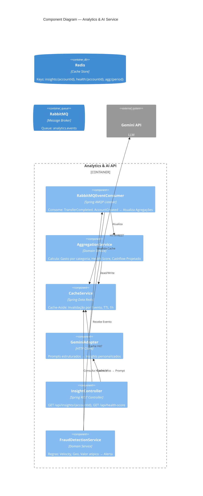

# Nível 3 — Component Diagram: Analytics & AI Service

Decomposição interna do **Analytics & AI API** em componentes principais.



## Componentes — Detalhamento

| Componente | Tipo | Framework | Responsabilidade |
| :--- | :--- | :--- | :--- |
| **RabbitMQEventConsumer** | Listener | Spring AMQP `@RabbitListener` | Consome fila `analytics.events`, deserializa `DomainEvent`, despacha para handlers |
| **AggregationService** | Domain Service | Spring Service | Recalcula métricas: `spendByCategory`, `monthlyCashflow`, `healthScore` (0-100) |
| **CacheService** | Infrastructure | Spring Data Redis | `RedisTemplate` ops: `get`, `set`, `evict` com TTL 1h; chave pattern `analytics:{domain}:{accountId}` |
| **GeminiAdapter** | Adapter | `WebClient` / `RestClient` | Monta prompt com contexto financeiro → chama `gemini-1.5-flash` → parseia JSON response |
| **InsightController** | Controller | Spring MVC `@RestController` | Expõe `GET /api/insights/{accountId}`, `GET /api/health-score/{accountId}` |
| **FraudDetectionService** | Domain Service | Spring Service | Avalia regras: `velocityCheck`, `geoAnomaly`, `amountOutlier` → emite `FraudAlertEvent` |

## Cache Strategy (Cache-Aside com Invalidação por Evento)

```mermaid
flowchart TD
    A[InsightController GET /insights/{id}] --> B{Cache Hit?}
    B -- Sim --> C[Return Cached JSON]
    B -- Não --> D[GeminiAdapter.generatePrompt]
    D --> E[Gemini API]
    E --> F[Parse Response]
    F --> G[CacheService.set(key, json, TTL=1h)]
    G --> C
    
    H[RabbitMQEventConsumer.onEvent] --> I[CacheService.evict(analytics:*:{accountId})]
```

| Chave Redis | TTL | Invalidação |
| :--- | :--- | :--- |
| `insights:{accountId}` | 1h | `TransferCompleted`, `AccountCreated` |
| `health:{accountId}` | 30min | `TransferCompleted` |
| `agg:monthly:{accountId}:{yyyy-MM}` | 2h | `TransferCompleted` |

## Integração Gemini API

**Prompt Template** (exemplo simplificado):
```text
Você é um assessor financeiro. Com base nos dados abaixo, gere 3 insights acionáveis em JSON:
- Gasto total mês: {totalSpent}
- Top 3 categorias: {categories}
- Saldo atual: {balance}
- Health Score: {healthScore}
- Transações recentes: {recentTxns}

Responda APENAS JSON: {"insights": [{"title": "", "description": "", "action": "", "priority": "high|medium|low"}]}
```

**Response Parsing**: `ObjectMapper` → `InsightDTO` → cache + return.

## Fraud Detection Rules

| Regra | Descrição | Threshold | Ação |
| :--- | :--- | :--- | :--- |
| **Velocity** | Muitas transações em pouco tempo | > 10 txns / 5 min | `FraudAlertEvent` + bloqueio temporário |
| **Geo Anomaly** | Transação em local incomum | País/Estado diferente dos últimos 30 dias | Alerta + notificação |
| **Amount Outlier** | Valor muito acima do padrão | > 3x desvio padrão histórico | Revisão manual |

## Endpoints REST

| Método | Path | Descrição | Cache |
| :--- | :--- | :--- | :--- |
| `GET` | `/api/insights/{accountId}` | Insights personalizados via Gemini | 1h |
| `GET` | `/api/health-score/{accountId}` | Score 0-100 + fatores | 30min |
| `GET` | `/api/analytics/spending/{accountId}` | Agregação por categoria/período | 2h |
| `GET` | `/api/fraud/alerts/{accountId}` | Alertas de fraude ativos | Real-time (no cache) |