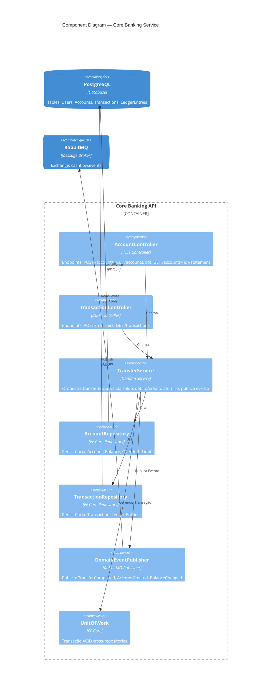
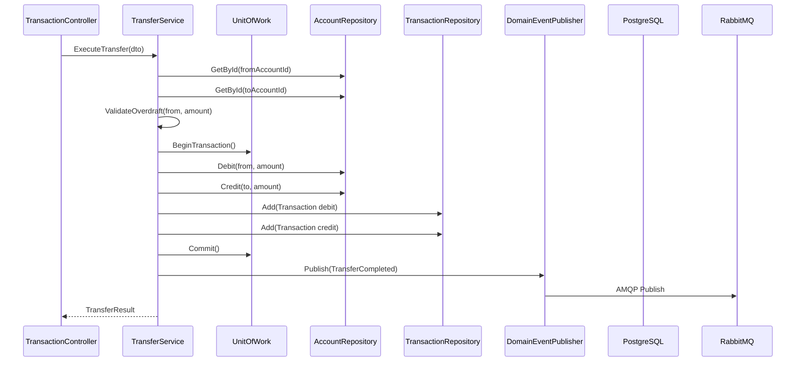

# Nível 3 — Component Diagram: Core Banking Service

Decomposição interna do **Core Banking API** em componentes (classes/serviços principais) e suas responsabilidades.

## Componentes — Detalhamento

| Componente | Tipo | Padrão | Responsabilidade |
| :--- | :--- | :--- | :--- |
| **AccountController** | Controller | REST Endpoint | HTTP boundary: cria conta, consulta saldo/extrato |
| **TransactionController** | Controller | REST Endpoint | HTTP boundary: inicia transferência, lista transações |
| **TransferService** | Domain Service | Application Service | Orquestra caso de uso `Transfer`: valida regras, coordena repositórios, emite evento |
| **AccountRepository** | Repository | Repository Pattern | `Account` aggregate persistence: `GetById`, `Save`, `UpdateBalance` |
| **TransactionRepository** | Repository | Repository Pattern | `Transaction` + `LedgerEntry` persistence: `Add`, `GetByAccount` |
| **DomainEventPublisher** | Infrastructure | Event Publisher | Serializa e publica `IDomainEvent` no RabbitMQ (exchange `cashflow.events`) |
| **UnitOfWork** | Infrastructure | Unit of Work | Garante atomicidade: `Account` + `Transaction` + `Ledger` em mesma transação DB |

## Domain Events Publicados

| Evento | Trigger | Payload Principal | Consumers |
| :--- | :--- | :--- | :--- |
| `AccountCreated` | `AccountController.Create` | `AccountId`, `HolderName`, `InitialBalance` | Analytics, Notifications |
| `TransferCompleted` | `TransferService.Execute` | `FromAccountId`, `ToAccountId`, `Amount`, `Timestamp` | Analytics, Notifications |
| `BalanceChanged` | `TransferService.Execute` | `AccountId`, `NewBalance`, `ChangeType` | Analytics |

## Regras de Negócio Encapsuladas no TransferService

1. **Saldo protegido**: `Balance - Amount >= -OverdraftLimit` (default -R$ 500)
2. **Idempotência**: `TransferId` único evita duplicidade
3. **Consistência ACID**: Débito origem + Crédito destino + Ledger em mesma transação
4. **Eventual consistency**: Evento publicado **após** commit da transação DB (Outbox Pattern implícito via EF Core transaction)

## Fluxo de Transferência (Interno)

