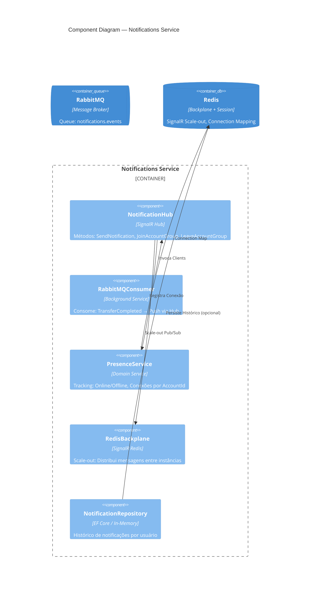
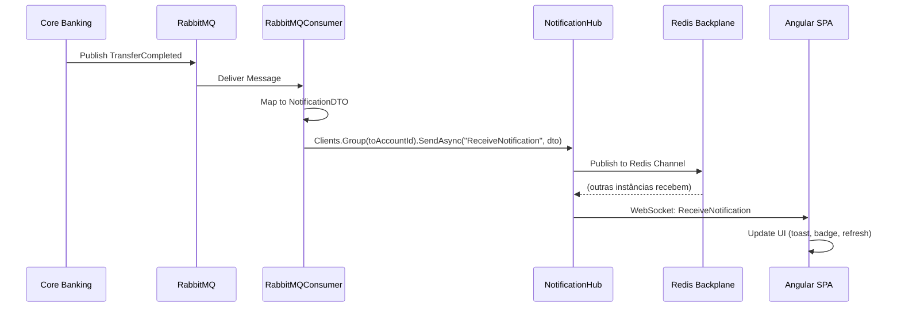
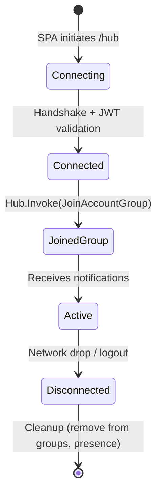

# Nível 3 — Component Diagram: Notifications Service

Decomposição interna do **Notifications Service** (SignalR + RabbitMQ Consumer).



## Componentes — Detalhamento

| Componente | Tipo | Framework | Responsabilidade |
| :--- | :--- | :--- | :--- |
| **NotificationHub** | Hub | ASP.NET Core SignalR | Gerencia ciclo de vida WebSocket: `OnConnectedAsync`, `OnDisconnectedAsync`, grupos por `AccountId` |
| **RabbitMQConsumer** | BackgroundService | `IHostedService` + `RabbitMQ.Client` | Consome `notifications.events`, mapeia `TransferCompleted` → `NotificationDTO` → `hub.Clients.Group(accountId).SendAsync()` |
| **PresenceService** | Domain Service | Singleton Service | Mantém `ConcurrentDictionary<AccountId, HashSet<ConnectionId>>`; expõe `GetOnlineAccounts()`, `IsOnline(accountId)` |
| **RedisBackplane** | Infrastructure | `Microsoft.AspNetCore.SignalR.StackExchangeRedis` | Permite múltiplas instâncias do serviço: publica no canal Redis → todas instâncias recebem e entregam aos seus clients locais |
| **NotificationRepository** | Repository | EF Core / In-Memory | Persiste `Notification` entity: `AccountId`, `Type`, `Payload`, `ReadAt`, `CreatedAt` |

## Fluxo de Notificação em Tempo Real



## SignalR Groups Strategy

| Group Name | Members | Use Case |
| :--- | :--- | :--- |
| `account:{accountId}` | Todas conexões do usuário (multi-device) | Notificações pessoais: transferência recebida, alerta fraude |
| `admin` | Conexões com role `Admin` | Alertas globais, métricas de sistema |

## Connection Lifecycle



## Redis Backplane Configuration

```csharp
// Program.cs
builder.Services.AddSignalR()
    .AddStackExchangeRedis(redisConnectionString, options => {
        options.Configuration.ChannelPrefix = "cashflow:signalr";
    });
```

| Config | Valor | Justificativa |
| :--- | :--- | :--- |
| `ChannelPrefix` | `cashflow:signalr` | Isolamento de canais em Redis compartilhado |
| `MaxRetries` | 3 | Resiliência a blips de rede |
| `ReconnectInterval` | 5s | Reconexão rápida |

## Eventos Consumidos (RabbitMQ)

| Evento | Queue | Handler | Ação no Hub |
| :--- | :--- | :--- | :--- |
| `TransferCompleted` | `notifications.events` | `TransferCompletedHandler` | `Clients.Group(toAccountId).SendAsync("ReceiveNotification", dto)` |
| `AccountCreated` | `notifications.events` | `AccountCreatedHandler` | `Clients.Group(accountId).SendAsync("WelcomeNotification", dto)` |
| `FraudAlert` | `notifications.events` | `FraudAlertHandler` | `Clients.Group(accountId).SendAsync("FraudAlert", dto)` + `Clients.Group("admin").SendAsync(...)` |

## Notification DTO (Exemplo)

```csharp
public record NotificationDto(
    Guid NotificationId,
    string Type,           // "TransferReceived", "FraudAlert", "Welcome"
    string Title,
    string Message,
    object? Payload,       // { amount, fromAccount, timestamp }
    DateTimeOffset CreatedAt,
    bool IsRead
);
```

## Angular Client Integration (Referência)

```typescript
// notification.service.ts
@Injectable({ providedIn: 'root' })
export class NotificationService {
  private hub = new HubConnectionBuilder()
    .withUrl(`${environment.apiUrl}/hubs/notifications`, {
      accessTokenFactory: () => this.auth.getToken()
    })
    .withAutomaticReconnect()
    .build();

  start(accountId: string) {
    this.hub.start()
      .then(() => this.hub.invoke('JoinAccountGroup', accountId));
  }

  onNotification = signal<NotificationDto | null>(null);
  
  constructor() {
    this.hub.on('ReceiveNotification', (dto) => this.onNotification.set(dto));
  }
}
```

## Escalabilidade

| Métrica | Estratégia |
| :--- | :--- |
| **Conexões simultâneas** | Horizontal scaling: múltiplas instâncias + Redis Backplane |
| **Mensagens/seg** | Partition RabbitMQ queues por `accountId` hash |
| **Latência P99** | < 100ms (local) / < 200ms (cross-region via backplane) |
| **Presença** | Redis `SET account:{id}:connections` com TTL 30s (heartbeat) |