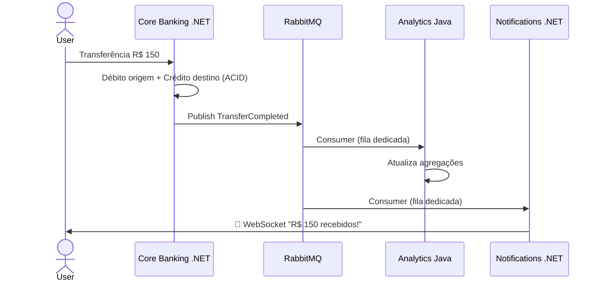

# 🔀 Event-Driven Architecture — RabbitMQ

## Contexto

O **Core Banking (.NET)** comunica eventos de negócio críticos (transferências concluídas, contas criadas) para os demais microsserviços sem acoplamento síncrono, garantindo resiliência caso um consumidor esteja indisponível.

## Decisão (ADR-001 e ADR-002)

Arquitetura **Orientada a Eventos (EDA)** com **RabbitMQ** como Event Bus.

- O **Core Banking** é *Publisher*: publica eventos de domínio padronizados (ex: `TransferCompleted`) em uma Exchange do tipo *Topic* (`cashflow-exchange`) após a consolidação ACID da transação no PostgreSQL.
- **Analytics (Java)** e **Notifications (.NET + SignalR)** são *Subscribers*: escutam filas dedicadas de forma assíncrona.

## Fluxo — Transferência Financeira (R$ 150)

## Eventos de Domínio

| Evento | Publicador | Consumidores |
|--------|-----------|--------------|
| `TransactionCreated` | Core Banking | Analytics, Notifications |
| `TransferCompleted` | Core Banking | Analytics, Notifications |

## Consequências

### Positivas
- **Desacoplamento**: publisher não conhece os consumidores
- **Resiliência**: mensagens seguras em filas duráveis
- **Escalabilidade**: processamento em background sem travar HTTP síncrono

### Desafios
- **Consistência eventual**: exige idempotência e compensação
- **Complexidade operacional**: gerenciar broker no Docker Compose e produção
