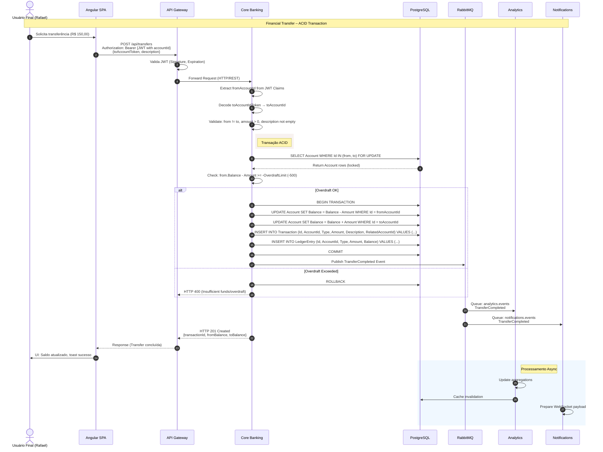

# Sequência 1 — Financial Transfer Flow

Fluxo síncrono completo de transferência entre contas (ACID transaction).



## Endpoints

| Passo | Endpoint | Método | Payload |
| :--- | :--- | :--- | :--- |
| 1 | `/api/transfers` | POST | `{toAccountToken: "acc-xxx", description: "Aluguel"}` |

## Domain Event (TransferCompleted)

```json
{
  "eventId": "uuid-v4",
  "eventType": "TransferCompleted",
  "timestamp": "2024-01-15T10:30:00Z",
  "data": {
    "transactionId": "uuid",
    "fromAccountId": "guid",
    "toAccountId": "guid",
    "amount": 150.00,
    "currency": "BRL",
    "description": "Aluguel"
  }
}
```

## Regras de Negócio

| Regra | Validação | Ação |
| :--- | :--- | :--- |
| **Saldo suficiente** | `Balance - Amount >= -OverdraftLimit` | Rollback + 400 |
| **Mesma conta** | `fromAccountId != toAccountId` | 400 Bad Request |
| **Valor positivo** | `amount > 0` | 400 Bad Request |
| **Idempotência** | Header `Idempotency-Key` | Retorna 200 se já processado |