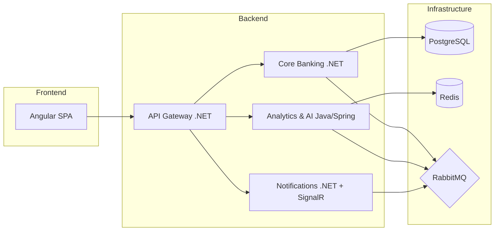

# 🏗️ System Design — CashFlow Pro

## Visão Geral

Plataforma fintech educacional em arquitetura de **microsserviços polyglot**, com .NET, Java e Angular.

## Diagrama de Arquitetura

## Serviços

| Serviço | Stack | Responsabilidade |
|---------|-------|-----------------|
| **Core Banking** | .NET 8+, EF Core, PostgreSQL | Contas, transferências, ledger, eventos de domínio (DDD) |
| **Analytics & AI** | Java Spring Boot 3, Redis, Gemini API | Insights financeiros, detecção de fraude, health score, cache |
| **Notifications** | .NET 8+, SignalR, Redis backplane | WebSocket em tempo real, notificações, presença |
| **API Gateway** | .NET 8+ (YARP/Ocelot) | Roteamento, JWT, rate limiting |
| **Frontend** | Angular 18 (Standalone, Signals) | Dashboard, transferências, insights |

## Infraestrutura

| Componente | Versão | Função |
|------------|--------|--------|
| PostgreSQL | 16 | Banco principal (Core Banking, Analytics) |
| Redis | 7 | Cache distribuído, sessões WebSocket, rate limiting |
| RabbitMQ | 4 | Event Bus / Mensageria |
| Docker Compose | - | Orquestração local |

## Observabilidade (Sprint 3)

- **OpenTelemetry**: tracing distribuído em todos os serviços
- **Prometheus + Grafana**: dashboards de métricas
- **Health Checks + Circuit Breaker**: resiliência e disponibilidade
- **Redis Rate Limiting** (sliding window): proteção dos endpoints

## Padrões de Integração

1. **Síncrono** (API REST) → Transferência confirmada na hora com consistência ACID
2. **Assíncrono** (Eventos/RabbitMQ) → Analytics e Notifications processam em background
3. **Real-time** (WebSocket/SignalR) → Notificações chegam no Angular sem refresh
4. **Cache** (Redis) → Insights cacheados com TTL, eviction por evento
