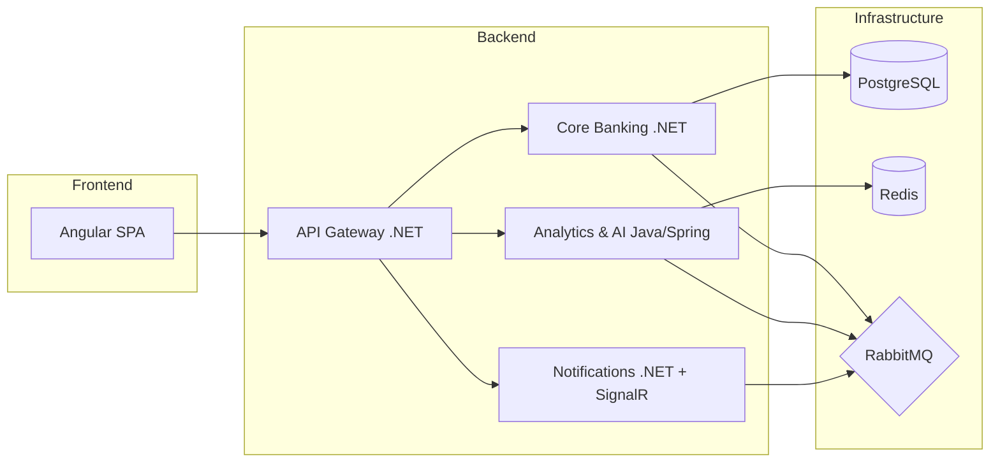
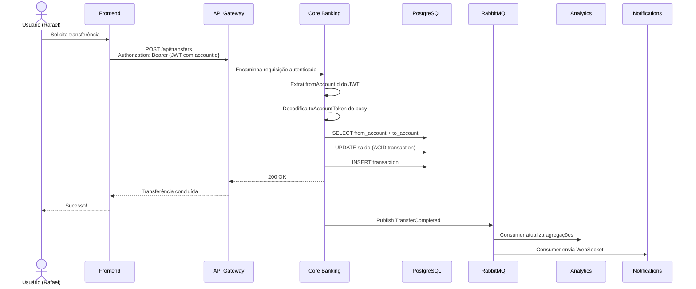

# 🏗️ System Design — CashFlow Pro

## Visão Geral

Plataforma fintech educacional em arquitetura de **microsserviços polyglot**, com .NET, Java e Angular.

## Diagrama de Arquitetura



## Serviços

| Serviço | Stack | Responsabilidade |
|---------|-------|-----------------|
| **Core Banking** | .NET 8+, EF Core, PostgreSQL | Contas, transferências, ledger, eventos de domínio (DDD) |
| **Analytics & AI** | Java Spring Boot 3, Redis, Gemini API | Insights financeiros, detecção de fraude, health score, cache |
| **Notifications** | .NET 8+, SignalR, Redis backplane | WebSocket em tempo real, notificações, presença |
| **API Gateway** | .NET 8+ (YARP/Ocelot) | Roteamento, JWT, rate limiting |
| **Frontend** | Angular 18 (Standalone, Signals) | Dashboard, transferências, insights |

## Infraestrutura

| Componente | Versão | Função |
|------------|--------|--------|
| PostgreSQL | 16 | Banco principal (Core Banking, Analytics) |
| Redis | 7 | Cache distribuído, sessões WebSocket, rate limiting |
| RabbitMQ | 4 | Event Bus / Mensageria |
| Docker Compose | - | Orquestração local |

## Observabilidade (Sprint 3)

- **OpenTelemetry**: tracing distribuído em todos os serviços
- **Prometheus + Grafana**: dashboards de métricas
- **Health Checks + Circuit Breaker**: resiliência e disponibilidade
- **Redis Rate Limiting** (sliding window): proteção dos endpoints

## Padrões de Integração

1. **Síncrono** (API REST) → Transferência confirmada na hora com consistência ACID
2. **Assíncrono** (Eventos/RabbitMQ) → Analytics e Notifications processam em background
3. **Real-time** (WebSocket/SignalR) → Notificações chegam no Angular sem refresh
4. **Cache** (Redis) → Insights cacheados com TTL, eviction por evento

## Domain Model (Sprint 1)

### Agregados e Relacionamentos

```mermaid
erDiagram
    USER {
        uuid Id PK
        uuid AccountId FK "UNIQUE"
        string Email "UNIQUE"
        string PasswordHash
        string Role
        datetime CreatedAt
    }
    
    ACCOUNT {
        uuid Id PK
        string HolderName
        decimal Balance
        string Type
        boolean IsActive
        datetime CreatedAt
    }
    
    TRANSACTION {
        uuid Id PK
        uuid AccountId FK
        string Type
        decimal Amount
        string Description
        uuid? RelatedAccountId FK
        datetime CreatedAt
    }

    USER ||--|| ACCOUNT : "has one"
    ACCOUNT ||--o{ TRANSACTION : "has many"
```

### Regras de Negócio (Sprint 1)

| Regra | Implementação |
|-------|---------------|
| 1 User → 1 Account | `AccountId` obrigatório e UNIQUE na tabela User |
| Criação atômica | User e Account criados na mesma transação no Register |
| Saldo protegido | Limite de cheque especial: -R$ 500 |
| Token seguro | JWT carrega claim `accountId` para identificar conta de origem |
| Transferência validada | Origem via JWT, destino via token no body da requisição |

### Fluxo de Transferência



## Evolução Planejada (Sprint 2+)

### Sprint 2
- **Analytics Service (Java/Spring)**: Consome eventos do RabbitMQ, expõe insights financeiros
- **Redis Cache**: Cache-Aside para agregações com invalidação por evento
- **Notification Service (.NET + SignalR)**: WebSocket para notificações em tempo real
- **Angular SPA**: Dashboard com gráficos e formulário de transferências

### Sprint 3
- **Gemini API**: Geração de insights financeiros via LLM
- **Observabilidade**: OpenTelemetry + Prometheus + Grafana
- **Resiliência**: Rate Limiting + Circuit Breaker
